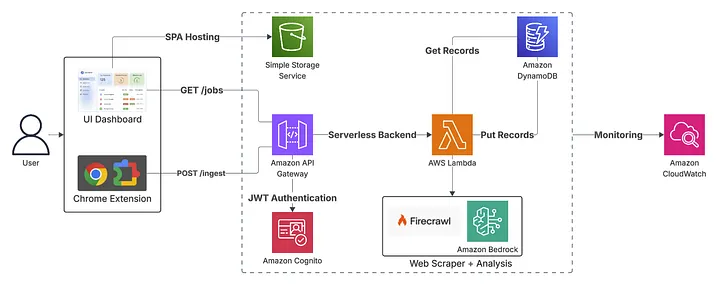

<div align="center">
  <h1>JobTrackr</h1>
  <p><strong>Smart Job Application Tracking with AI-Powered Analysis</strong></p>

  <p>Stay organized in your job search with intelligent tracking, automated data extraction, and insightful analytics.</p>

  <a href="https://drive.google.com/file/d/1YzihsxoOkMy4ajigzhPtyu7Q4HJeCp5F/view?usp=sharing">Video Demo</a> •
  <a href="#architecture">Architecture</a> •
  <a href="#quick-start">Quick Start</a> •
  <a href="https://medium.com/aws-in-plain-english/learning-aws-the-practical-way-deploy-debug-deliver-3b8d946d90fd">Blog Series</a>
</div>

---

## Overview

JobTrackr is a full-stack serverless application that streamlines job application tracking. Simply capture job URLs through the Chrome extension, and let AI automatically extract and analyze job details. Track your applications, monitor progress, and gain insights through an intuitive dashboard.

### Key Features

- **AI-Powered Analysis** - Automatic job detail extraction and analysis using Claude
- **Chrome Extension** - One-click job capture with keyboard shortcuts
- **Real-Time Dashboard** - Track applications, view statistics, and manage your pipeline
- **Serverless Architecture** - Cost-effective, scalable AWS infrastructure
- **Secure Authentication** - AWS Cognito OAuth 2.0 integration

---

## Architecture

JobTrackr consists of three main components:



<div align="center">
  <em>Full-stack serverless architecture with Chrome Extension, AWS Lambda backend, and React frontend</em>
</div>

<br>

### Tech Stack

- **Frontend**: React 19, TypeScript, Vite
- **Backend**: AWS Lambda (Python), API Gateway
- **Database**: DynamoDB
- **AI**: AWS Bedrock (Claude), Firecrawl
- **Auth**: AWS Cognito
- **Extension**: Chrome Extension Manifest V3

---

## Quick Start

### Prerequisites

- Node.js 18+ and npm
- Python 3.12+
- AWS CLI configured with credentials
- AWS SAM CLI installed
- Chrome browser (for extension)

### 1. Backend Setup

```bash
cd backend-lambda
sam build
sam deploy --guided
```

Configure during deployment:
- Firecrawl API key
- LLM provider (Anthropic or Bedrock)
- Cognito user pool details

**[Full Backend Documentation →](backend-lambda/README.md)**

### 2. Frontend Setup

```bash
cd frontend-react
npm install
cp .env.example .env
# Edit .env with your AWS Cognito and API Gateway URLs
npm run dev
```

Access at: `http://localhost:5173`

**[Full Frontend Documentation →](frontend-react/README.md)**

### 3. Chrome Extension Setup

```bash
# Navigate to chrome://extensions/
# Enable "Developer mode"
# Click "Load unpacked" and select chrome-extension folder
```

**[Full Extension Documentation →](chrome-extension/README.md)**

---

## Usage

### Capturing Job Applications

1. **Browser Extension** - Press `Ctrl+Shift+K` (or `Cmd+Shift+K` on Mac) while viewing any job posting
2. **AI Processing** - Job details are automatically extracted and analyzed
3. **Dashboard View** - View and manage all captured jobs in the React dashboard

### Managing Applications

- **Update Status** - Mark jobs as Applied, Interview, Offer, or Rejected
- **Add Notes** - Keep track of follow-ups, interview dates, and more
- **View Analytics** - See application statistics and trends
- **Delete Jobs** - Remove applications you no longer want to track

---

## API Documentation

### Endpoints

| Method | Endpoint | Description |
|--------|----------|-------------|
| `POST` | `/api/jobs/ingest` | Submit job URL for AI analysis |
| `GET` | `/api/jobs` | Get paginated list of jobs |
| `PUT` | `/api/jobs/{id}` | Update job status/notes |
| `DELETE` | `/api/jobs/{id}` | Delete a job |
| `GET` | `/api/stats` | Get application statistics |

All endpoints require AWS Cognito authentication via Bearer token.

**[View OpenAPI Specification →](backend-lambda/openapi.yaml)**

---

## Project Structure

```
JobTrackr/
├── backend-lambda/          # AWS Lambda backend
│   ├── lambda_function.py   # Main handler
│   ├── handlers.py          # API handlers
│   ├── db.py               # DynamoDB operations
│   ├── analyzer.py         # AI analysis
│   └── template.yaml       # SAM configuration
│
├── frontend-react/         # React dashboard
│   ├── src/
│   │   ├── pages/         # Dashboard, Login, Callback
│   │   ├── services/      # API client
│   │   └── utils/         # Auth utilities
│   └── package.json
│
└── chrome-extension/       # Chrome extension
    ├── manifest.json
    ├── background.js      # Service worker
    ├── popup.html        # Extension UI
    └── content-overlay.js # Page interaction
```

---

## Resources

### Documentation

- [Backend Documentation](backend-lambda/README.md) - Lambda, DynamoDB, AI setup
- [Frontend Documentation](frontend-react/README.md) - React app configuration
- [Extension Documentation](chrome-extension/README.md) - Chrome extension setup

### Media & Guides

- **Video Demo**: [Watch video](https://drive.google.com/file/d/1YzihsxoOkMy4ajigzhPtyu7Q4HJeCp5F/view?usp=sharing)
- **Architecture Diagram**: [View Diagram](Architecture.webp)
- **Medium Blog Series**: [Learning AWS the Practical Way: Deploy, Debug, Deliver](https://medium.com/aws-in-plain-english/learning-aws-the-practical-way-deploy-debug-deliver-3b8d946d90fd)

---

## Development

### Running Locally

```bash
# Terminal 1 - Backend
cd backend-lambda
sam local start-api

# Terminal 2 - Frontend
cd frontend-react
npm run dev
```

### Testing

```bash
# Backend - Use SAM local invoke
sam local invoke -e backend-lambda/test_events/test_event.json

# Frontend - Run dev server
npm run dev

# Extension - Load unpacked in chrome://extensions/
```

### Deployment

```bash
# Backend
cd backend-lambda
sam build && sam deploy

# Frontend
cd frontend-react
npm run build
aws s3 sync dist/ s3://your-bucket --delete

# Extension - Package and upload to Chrome Web Store
```

---

## Cost Estimation

**Monthly costs for ~100 job applications:**

- **Lambda**: ~$0.20 (AWS Free Tier covers most)
- **DynamoDB**: ~$0.50 (on-demand pricing)
- **API Gateway**: ~$0.10
- **Bedrock/Claude**: ~$2-5 (varies by usage)
- **S3 + CloudFront**: ~$0.50

**Total**: ~$3-6/month

---

## Contributing

Contributions are welcome! Please feel free to submit a Pull Request.

1. Fork the repository
2. Create your feature branch (`git checkout -b feature/AmazingFeature`)
3. Commit your changes (`git commit -m 'Add some AmazingFeature'`)
4. Push to the branch (`git push origin feature/AmazingFeature`)
5. Open a Pull Request

---

## License

This project is open source and available under the [MIT License](LICENSE).

---

## Support

- **Issues**: [GitHub Issues](https://github.com/anpise/JobTrackr/issues)
- **Discussions**: [GitHub Discussions](https://github.com/anpise/JobTrackr/discussions)

---

<div align="center">
  <p>Built with ❤️ using AWS, React, and Claude AI</p>
  <p>
    <a href="https://drive.google.com/file/d/1YzihsxoOkMy4ajigzhPtyu7Q4HJeCp5F/view?usp=sharing">Demo</a> •
    <a href="https://medium.com/aws-in-plain-english/learning-aws-the-practical-way-deploy-debug-deliver-3b8d946d90fd">Blog</a> •
    <a href="https://github.com/anpise/JobTrackr">Star on GitHub</a>
  </p>
</div>
